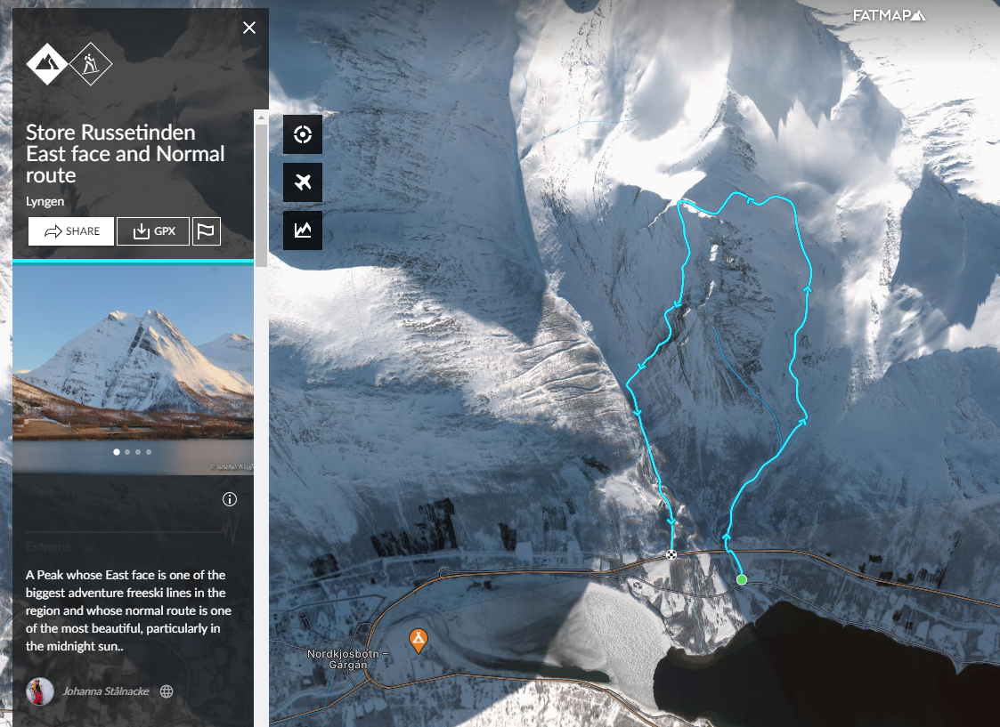
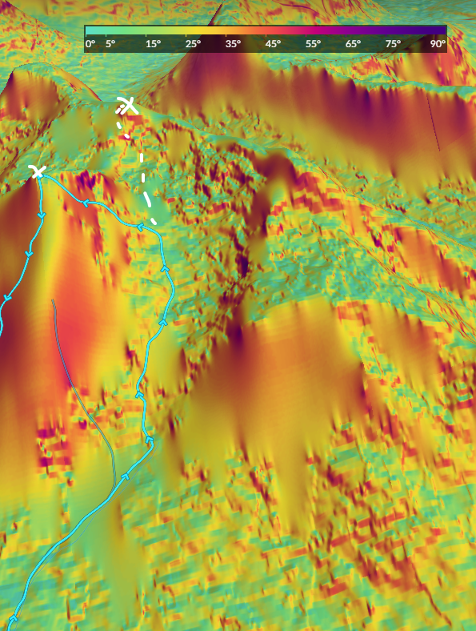
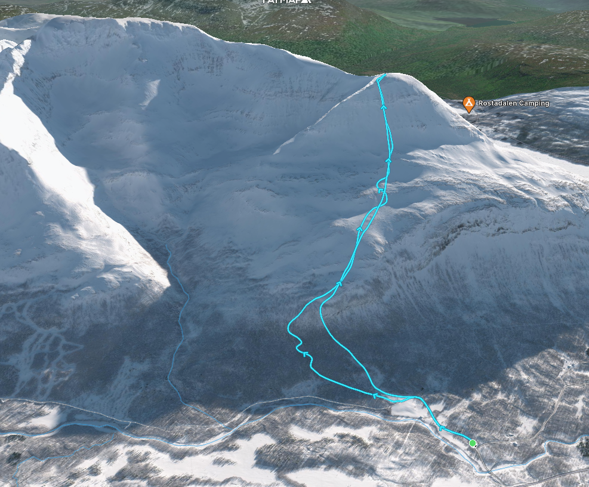
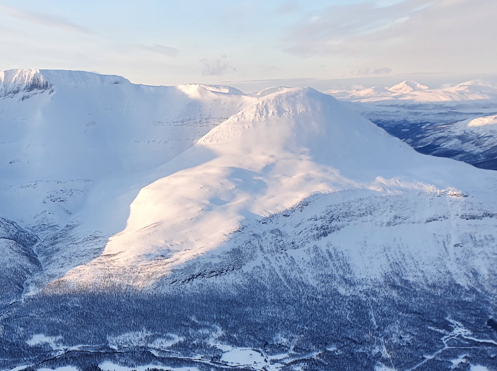
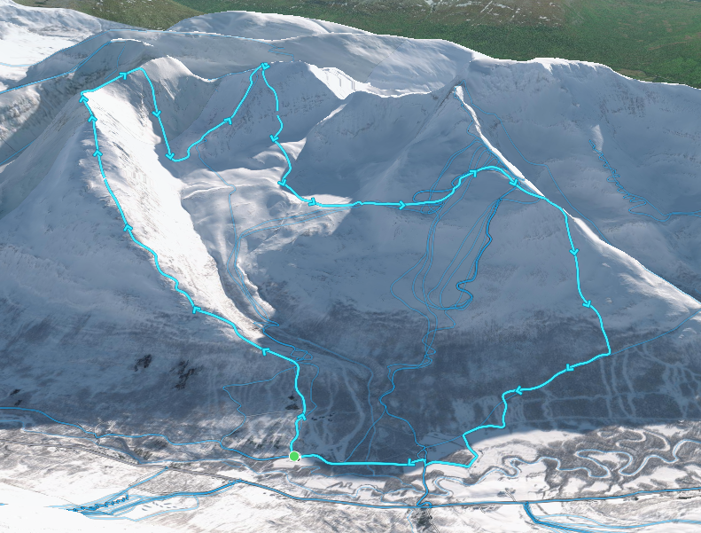
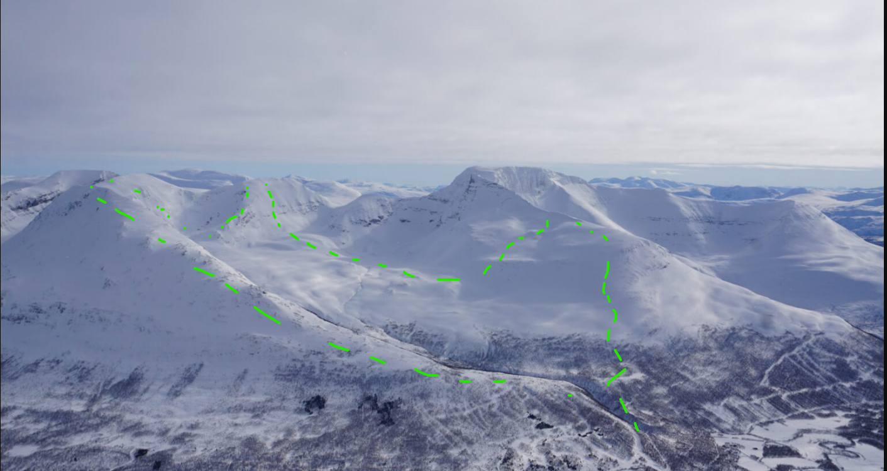
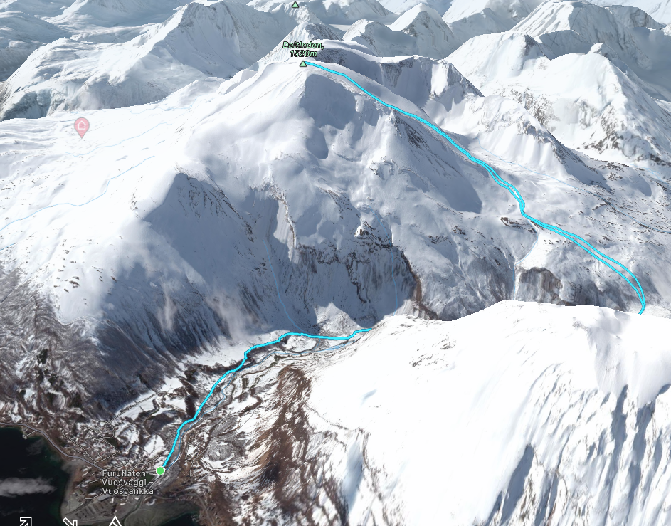

# Friday, the good one

## Store Russetinden

Dont mind the downhill in the bellow route. We would take the normal route. Alternative peak that should be easier. Otherwise nice route with challanges. ~1300 meters of elevation. There is also some more possible options after the peak to go to the other peaks e.g. the alternative one or the one the the viewers right.

https://fatmap.com/routeid/1768940/Store_Russetinden_East_face_and_Normal_route/@69.2076107,19.4496842,4162.2537648,-24.3835743,205.0203352,492.8849467,satellite,winter

## Rostakulen Northface

- Description: https://www.whereiskylemiller.com/tamokdalen/rostakulen-north/
- Fatmap: https://fatmap.com/routeid/3077648/rostakulen?utm_source=embed&utm_medium=organic&utm_campaign=https://www.whereiskylemiller.com/

Would be really cool line. But probably mostly in the shade and also hard to find alternatives for the part of the group that does not want to go to the top.

## Istenden Ridge +

- Description: https://www.whereiskylemiller.com/tamokdalen/melkefjellet-istinden-ridge/
- Fatmap: https://fatmap.com/routeid/3077638/melkefjellet-and-istinden-ridge^

Nice ridge line thats not to difficult. Some good lines. But need to take the lines, no second options. Second group could go straight for the 3rd "peak" of this route: https://fatmap.com/routeid/2967056/Istinden_Northeast_Ridge_behind_Tamokdalen/@69.0733932,19.6367379,4113.3793681,-29.7082964,157.9065408,603.9464435,satellite,winter. With max slopes of 30 deg its not hard and should offer some fun skiing.

## Daltinden

Straight forward. Daltinden. Close to the possible sport shop. Easy to do for everyone. Easy Parking. A bit boring.

- Description: https://www.whereiskylemiller.com/lyngen-alps/daltinden/
- Fatmap: https://fatmap.com/routeid/3075992/daltinden?utm_source=embed&utm_medium=organic&utm_campaign=https://www.whereiskylemiller.com/

