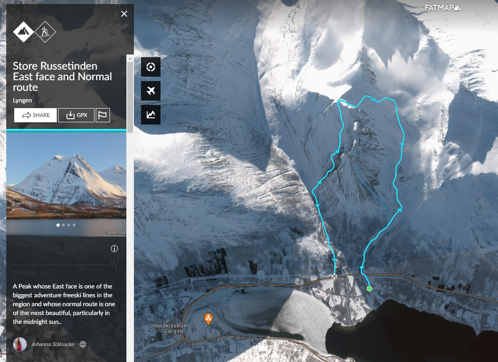

# Tours for Wednesday

Based on:
- Weather best in area
- Has to start from Sea
- Doable for all
- Optional: Some challanges/options to do extra miles and/or spicey downhills

## Weather

Weather is forcastet to be a bit better in the vallay we are at:  

## Options 1 - Store Russetinden

### Route
Dont mind the downhill of the east face. We looking at going down the "normal" route, which is the same as the uphill. Its about 1300m of accent.

The top part can be a bit steep. If too much whiteout and/or conditions for climbing up bad and/or too steep for some of the group, alternative could be to go all the way back to the peak at the end of the plateau. About 1500.

### Parking
Just on the side of the road of the main road. Maybe a bit tricky to find sth.

### Summary
- Offically in the ski touring book as well as as a tour on fatmap
- Good alternatives, nice terrain
- From the sea
- Could be on the more difficult side for some of the group. Even the "easy" alternative
- Finally a reason to take the crampons!

## Option 2 - Bergefjell

### Route
Couldnt find any offical route of this, but looks nice and not so steep. Only problem could be, 1) the Start through the bushes 2) The route finding if visiblity is bad.

### Parking
There seems to be a nice parking lot right at the sea to start from.

### Summary
- Could be an adventure as I havent found anything "offical" about it for ski touring
- Shallow grades. But if visiblity is ok there can also be many nice downhill alternatives
- Start at sea, pottentially nice views. 2 "peaks".

### Option 3 - Tree Line Skiing up the valley

Some tree line skiing up the valley. Options can be scouted from road, parking the same.

